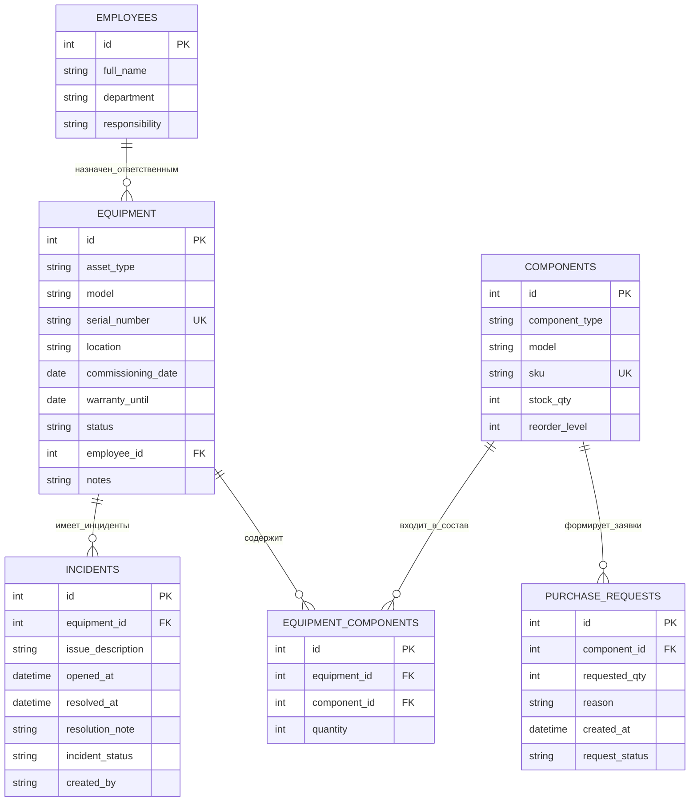

# Диаграмма «Сущность-Связь» для АИС учета ИТ-активов

## Краткие пояснения по связям

- `employees (1) -> (N) equipment` — один сотрудник может отвечать за несколько устройств.
- `equipment (1) -> (N) incidents` — у одного устройства может быть множество инцидентов.
- `equipment (N) <-> (N) components` — реализовано через таблицу `equipment_components`.
- `components (1) -> (N) purchase_requests` — на одну позицию комплектующих может быть много заявок.
