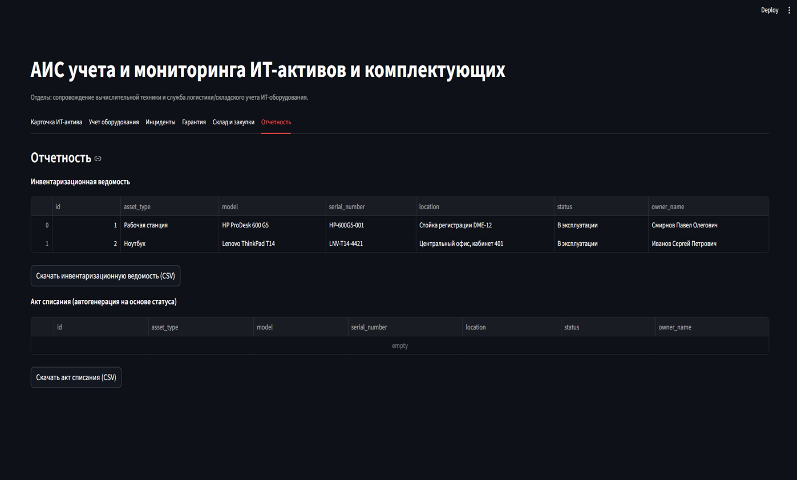

# AIS — IT Asset Management System

**Automated information system for accounting and monitoring of IT assets and components.**

A web-based prototype developed during production practice for an IT support and logistics department. The system centralizes equipment records, tracks incidents, monitors warranty periods, manages spare parts inventory, and generates procurement requests and reports.

> Context: built for a corporate IT support workflow (equipment lifecycle, spare parts warehouse, critical workstations such as check-in desks).

---

## Screenshots

> Add screenshots to `docs/screenshots/` and uncomment the lines below.

<!--



-->

---

## Features

| Module | Description |
|--------|-------------|
| **Equipment registry** | Register IT assets: type, model, serial number, location, status, responsible employee |
| **Asset card** | View full device profile and installed components (RAM, SSD, GPU, etc.) |
| **Incidents** | Log failures and maintain repair history |
| **Warranty control** | Automatic alerts for expiring manufacturer support |
| **Warehouse & procurement** | Track spare parts stock and auto-generate purchase requests on low inventory |
| **Reporting** | Export inventory lists and disposal acts to CSV |

---

## Tech Stack

| Layer | Technologies |
|-------|-------------|
| **Backend / Logic** | Python 3.10+ |
| **UI** | Streamlit |
| **Database** | SQLite (relational model, foreign keys) |
| **Data processing** | Pandas |

---

## Architecture

```
┌─────────────────────────────────────────────────────────┐
│                    Streamlit UI (app.py)                 │
│  Tabs: Asset Card │ Registry │ Incidents │ Warranty │   │
│        Warehouse │ Reports                                │
└────────────────────────┬────────────────────────────────┘
                         │
                         ▼
┌─────────────────────────────────────────────────────────┐
│              Business logic + SQL queries                │
└────────────────────────┬────────────────────────────────┘
                         │
                         ▼
┌─────────────────────────────────────────────────────────┐
│           SQLite DB (db.py → ais_assets.db)              │
│  employees │ equipment │ incidents │ components │       │
│  equipment_components │ purchase_requests                │
└─────────────────────────────────────────────────────────┘
```

**Database entities:**
- `employees` — staff and responsibility zones
- `equipment` — IT asset records
- `incidents` — failure and repair log
- `components` — spare parts catalog and stock levels
- `equipment_components` — device composition (many-to-many)
- `purchase_requests` — procurement requests

See [ERD_AIS_IT_Assets.md](ERD_AIS_IT_Assets.md) and [ERD_AIS_IT_Assets.png](ERD_AIS_IT_Assets.png) for the entity-relationship diagram.

---

## Quick Start

### Prerequisites

- Python 3.10 or newer
- pip

### Installation

```powershell
git clone https://github.com/Sergey051291/AIS.git
cd AIS

python -m venv .venv
.\.venv\Scripts\activate

pip install -r requirements.txt
```

### Run

```powershell
streamlit run app.py
```

Open the URL shown in the terminal (default: `http://localhost:8501`).

On first launch the database is created automatically and populated with demo data (employees, equipment, components).

---

## Project Structure

```
AIS/
├── app.py                  # Streamlit UI and business logic
├── db.py                   # Database schema, initialization, seed data
├── requirements.txt
├── ERD_AIS_IT_Assets.md    # ER diagram (Mermaid)
├── ERD_AIS_IT_Assets.png   # ER diagram (image)
├── docs/
│   └── screenshots/        # UI screenshots for README
└── README.md
```

---

## Demo Data

The seed dataset includes sample records such as:
- HP ProDesk workstation at a check-in desk
- Lenovo ThinkPad laptop
- Components: NVIDIA GTX 1050, Samsung SSD, Dell monitor, HP cartridge

---

## Possible Improvements

- Role-based access control
- Integration with Service Desk / ERP systems
- Email notifications for warranty and stock alerts
- Migration to PostgreSQL for production deployment
- Extended analytics (MTTR, failure recurrence, demand forecasting)

---

## Author

Developed as a production practice project (09.03.02 — Information Systems and Technologies).

**Stack:** Python · Streamlit · SQLite · Pandas
